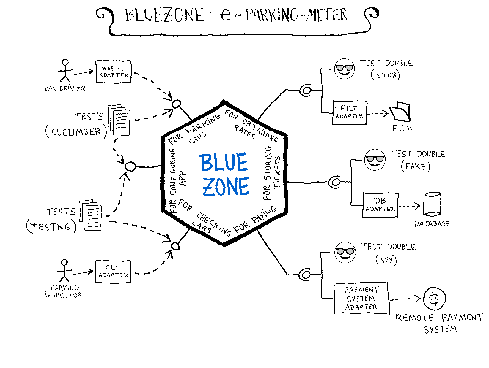

# BlueZone
## An example application implementing Hexagonal Architecture

See the article series: [https://jmgarridopaz.github.io/content/hexagonalarchitecture-ig/intro.html]

__BlueZone__ allows car drivers to pay remotely for parking cars at regulated parking areas in a city, instead of paying with coins using parking meters.

- Users (driver actors) of the application are _car drivers_ and _parking inspectors_.

  - Car drivers will access the application using a Web UI (User Interface), and they can do the following:
    
    - Query all the available rates in the city, in order to choose the one of the regulated he wants to park the at.
    - Get a parking permit, providing the ending datetime of the permit period (the starting datetime is the one at which the permit is requested), and paying for the permit using a card.

  - Parking inspectors will access the application using a terminal with a CLI (Command Line Interface), and they can do the following:
  
    - Check whether a parked car doesn't have any active permit for the rate of the area the car is parked at.
    
- Driven actors needed by the application are: a rate repository, a permit repository, and a payment system.

### Development environment:

- Java 9 (jdk-9.0.4)

- Maven 3.5.4

- Eclipse IDE 2019-12 (4.14.0)

- Ubuntu 18.04.5 LTS (Linux 5.4.0-48-generic)

### Compile and Run Instructions:

- Download and extract this github repo to a local directory on your computer ( `<bluezone_dir>` )

- Compile all modules (you need to do this just the first time before running):
  
  ~~~
  cd <bluezone_dir>
  ./scripts/build.sh
  ~~~

- Run hardcoded driver ports tests:
  
  ~~~
  cd <bluezone_dir>
  ./scripts/hardcodedhexagon/run_forparkingcars_test.sh
  ~~~
  
  ~~~
  cd <bluezone_root_dir>
  ./scripts/hardcodedhexagon/run_forcheckingcars_test.sh
  ~~~
